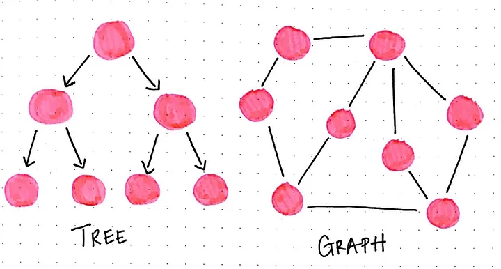
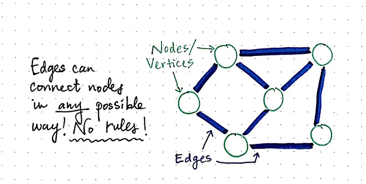
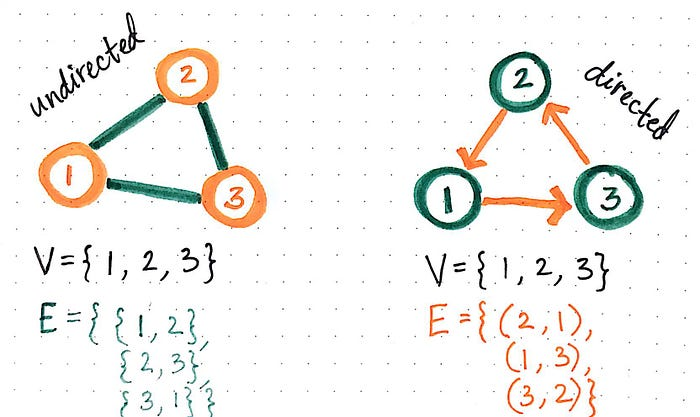
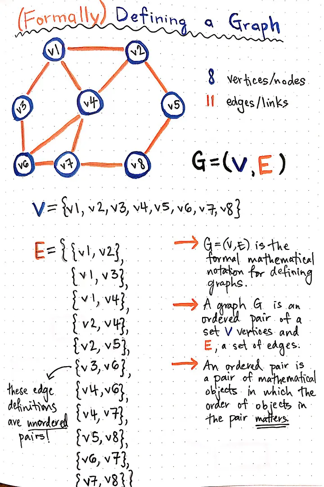
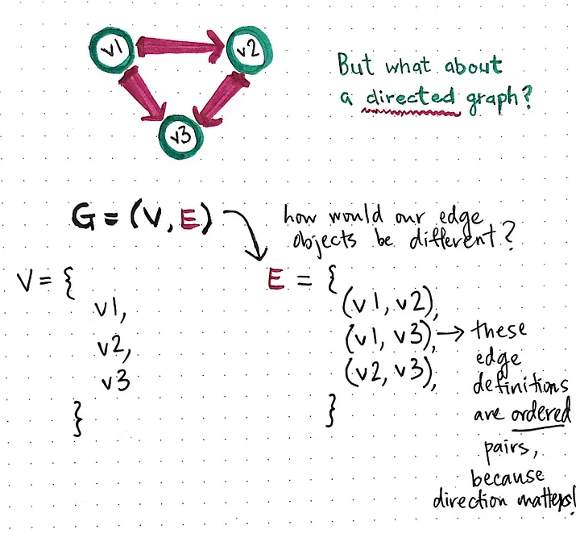

## Graphs

> ### Currently for Adjacency Lists only!
>
> TODO:// Adjacency matrix, Incidence matrix

### Graph Theory

G: (V,E)
V => set of nodes/nodes
E => set of links/links

### Types of graphs

- Undirected Graph
  

- Directed Graph
  

### Operations

- adjacent(G, x, y): tests whether there is an link from the node x to the node y;
- neighbors(G, x): lists all nodes y such that there is an link from the node x to the node y;
- add_node(G, x): adds the node x, if it is not there;
  remove_node(G, x): removes the node x, if it is there;
- add_link(G, x, y, z): adds the link z from the node x to the node y, if it is not there;
- remove_link(G, x, y): removes the link from the node x to the node y, if it is there;
- get_node_value(G, x): returns the value associated with the node x;
- set_node_value(G, x, v): sets the value associated with the node x to v.
- Structures that associate values to the links usually also provide:[1]

- get_link_value(G, x, y): returns the value associated with the link (x, y);
- set_link_value(G, x, y, v): sets the value associated with the link (x, y) to v.

### Operation Complexities for Adjacency List

| Operation                  | Complexity                                                                        |
| -------------------------- | --------------------------------------------------------------------------------- |
| Store graph                | O(V + E)                                                                          |
| Add node                   | O(1)                                                                              |
| Add link                   | O(1)                                                                              |
| Remove node                | O(E)                                                                              |
| Are nodes x and y adjacent | O(V)                                                                              |
| Remark                     | Slow to remove vertices and edges, because it needs to find all vertices or edges |

### Corner cases

Empty graph
Graph with one or two nodes
Disconnected graphs
Graph with cycles

### Traversing and common search algorithms

- Breadth-first Search
- Depth-first Search

### Sources & References

- [meidum.com/vaidehi-joshi](https://medium.com/basecs/a-gentle-introduction-to-graph-theory-77969829ead8)
- [techinterviewhandbook.org/graphs](https://www.techinterviewhandbook.org/algorithms/graph/)
- [wikipedia](https://en.wikipedia.org/wiki/Graph_(abstract_data_type))